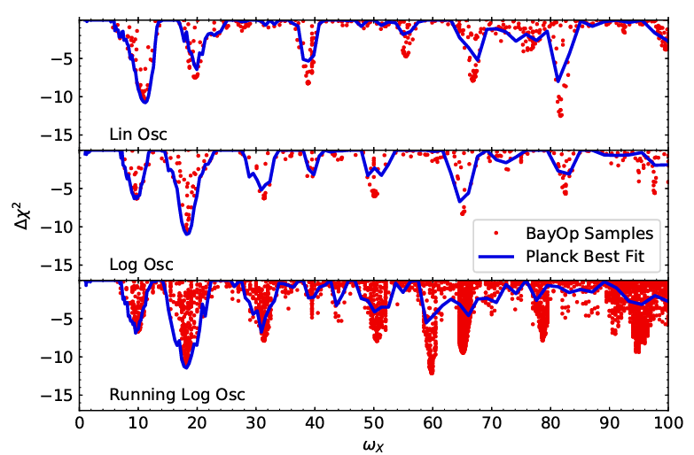

==================================
Bayesian Optimisation via CosmoMC
==================================
:Author: Julius Wons
:Contact: j.wons@unsw.edu.au 

Description
============

This code is a fork to CosmoMC and replaces the MCMC sampling algorithm with a Bayesian Optimisation. It efficiently samples the likelihood space of complex likelihood functions to find the set of best fit parameters.

Motivation
============
The conventionally used MCMC sampling method performs well dimensional feature space with simple and well-behaved likelihood functions. Certain primordial models produce complicated likelihood functions with multiple local maxima. The MCMC Sampling method struggles with these likelihood functions. Reliable maximising of the likelihood function requires a lot of parameter tuning and a lot of time. I replaced the MCMC sampling with Bayesian Optimisation to find the maximum of likelihood function.

Goal
=====
Design an algorithm and code that is simple and fast to use. It should be applicable to a large range of models without the need to tune any parameters. Furthermore, the runtime with the MCMC sampling was of the order weeks. I want to reduce this to the order of hours.

Result
========
The resulting code is able to find the set of cosmological parameters describing the data best. Furthermore, it does so in only a couple of hours (depending on the number of CPUs available). Finally, we were able to reproduce the results of the MCMC sampling and even find better parameter combinations leading to an improved fit. Below, I show the results for different models comparing the MCMC best fit (blue) to the results using the BayOp algorithm (red) for a feature :math:`$\omega_X$`. The goodness of the fit is given by :math:`$\Delta\chi^2$`.

Installation and tests
================

Installation is similar to CosmoMC see the `ReadMe <http://cosmologist.info/cosmomc/readme.html>`_.

Requires installation of the  `unbinned Planck likelihood <https://pla.esac.esa.int/#cosmology>`_ (bin1). See `Planck Readme <https://cosmologist.info/cosmomc/readme_planck.html>`_.
Requirements for the compiler are the same as for CosmoMC.
The code was tested for intel 18.0.1 or newer compiler. Technically should work for gcc compiler

After downloading the code, go to ./source and and compile the code using
::
  make
After that go back to base dictonary. There are two test files.
First, test.ini uses likelihood native to CosmoMC. You do not need the Planck likelihoods for this one.
Running ::
  ./cosmomc test.ini
will run a quick example with logarithmic oscillations. This should take around 1-2 hours and requires around 2GB memory. 
If it does not crash immediately, then the installation should be fine.
For a quick check, change in test.ini action=3 to action=4. This will quickly check the likelihood.

When the unbinned planck likelihood has been installed, you can test it by running
::
  ./cosmomc test_planck_lin.ini
This will run an example with linear oscillations using the Planck likelihood code. This will need around 15-20GB
of memory and takes around 10-12 hours. The value of the best fit should be around 6.25. The data will be saved in
./Output/planck_test.txt and can be plotted with plot_test.py. The results should look similar to test.pdf

Implementation of other modulations of the primordial power spectrum
=====================================================================
Four different modulations to the primordial power spectrum are already implemented.
Linear oscillations, logarithmic oscillations, logarithmic oscillations with running frequency,
and three different versions of the primordial standard clock.

To implement your own model, simply overwrite one of the models in /camb/fortran/InitialPower.f90
Five parameters are already implemented: AmpOsc, linfreq, phase, newP4, newP5
These can be used in your own models. Afterwards you need to include prior ranges for each parameter in
the .ini file.

Algorithm details
==================

See the latest `paper <http://arxiv.org/abs/1304.4473>`_.
